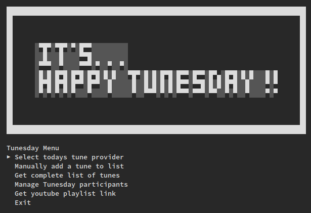

# :musical_note: Tunesday :musical_note:

#### Because every Tunesday deserves a soundtrack!

## What is this?
Tunesday is a tiny terminal app that helps your team pick a weekly music provider, collect everyone’s YouTube picks, and spit out a playlist. 

**Relaxed office ritual meets minimal CLI fun.**

The tool evolved around our long-standing team tradition of celebrating Tunesdays in the development team [@USP](https://github.com/united-security-providers)
> We wish each other "a happy Tunesday", appreciate how wonderful it is to have music, and finally — typically at the end of our daily meeting — run this tool to determine who will provide today's soundtrack. 

## Highlights
- Tu(n)esday-aware: refuses to run on non-Tuesdays... unless you insist.
- Fun little TUI: arrow keys to navigate, Enter to select, Esc/Ctrl-C to bail (it will still try to save).
- Paste any YouTube link (watch, youtu.be, shorts) — the tool will normalize the ID and fetch the title.
- Local-first: data is just a JSON file in your repo/home dir.

## Quick Start
1) Build
   - With Makefile: `make build`
   - Or plain Go: `go build -o build/tunesday ./cmd/tunesday`

2) Run
   - Default: ./build/tunesday
   - Force run on a day-that-shall-not-be-named: ./build/tunesday --force-tunesday
   - Radio mode: ./build/tunesday --radio ([not implemented yet ^^](https://github.com/daum3ns/tunesday/issues/1))

3) Keys inside the app
   - KeyUp/KeyDown to move
   - Enter to select
   - Esc to go back/exit menu
   - Ctrl-C to quit

## Data & Configuration
- Storage file: tunesday.json (in current working directory).
- Change location with env var:
  - TUNESDAY_DATA_FILE=/path/to/wherever.json ./build/tunesday

## What does it store?
- Participants (with how many times they’ve provided tunes)
- The list of tunes (title, link, normalized YouTube ID, provider, timestamp)

## Feature Tour (aka the menu)
- Select todays tune provider: choose who’s on deck, paste a YouTube link, it will grab the title.
- Manually add a tune to list: type it in old-school.
- Get complete list of tunes: list for bragging rights.
- Manage Tunesday participants: add/remove/disable/enable members.
- Get youtube playlist link: a sharable link that bundles the IDs you’ve collected.
- Exit: The tool will save on the way out. Promise.

## Tips & Tricks
- Not Tuesday? Then enforce it with `--force-tunesday`. But don't abuse this!
- Share your data with your team by pointing TUNESDAY_DATA_FILE at a repo file or syncing it somewhere.

## FAQ
- Does this sync to the cloud? No. It’s delightfully offline. However, you can simply sync the .json file somewhere you like... (and share it with your team)
- Will it lose my data if I mash Ctrl-C? It tries very hard to save before exiting.
- Can I use Vimeo/SoundCloud? Currently [not](https://github.com/daum3ns/tunesday/issues/2), the happy path is YouTube.

## YouTube Details
- Accepts links like:
  - https://www.youtube.com/watch?v=VIDEOID
  - https://youtu.be/VIDEOID
  - https://www.youtube.com/shorts/VIDEOID
  - https://music.youtube.com/watch?v=VIDEOID
- Trims tracking bits (&si=... and friends) and keep it clean.
- Uses [github.com/kkdai/youtube](https://github.com/kkdai/youtube) to fetch titles, thanks!! :pray:
  - no API key needed for basic title lookup.

## Development
- Requirements: Go 1.23+
- Build: `make build`
- Test: `make test` or `go test ./...`

### Project Layout
- cmd/tunesday: entrypoint
- internal/app: app loop and menu wiring
- internal/termui: tiny text UI helpers (menu, headers, etc.)
- internal/storage: JSON file store (atomic saves)
- internal/playlist: YouTube parsing + title fetcher
- internal/core: simple data structs

### License
- See LICENSE. Be nice, share tunes.
