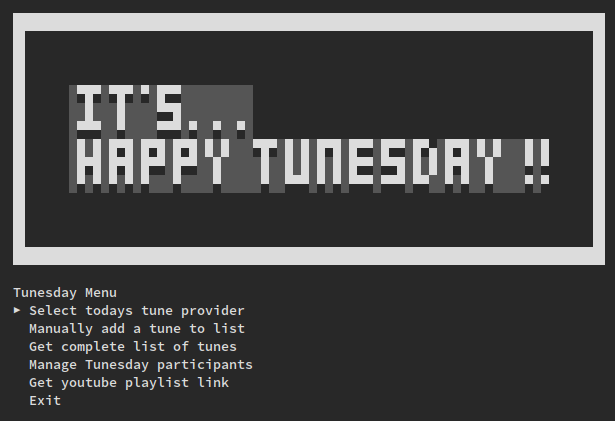

# :musical_note: Tunesday :musical_note:

#### Because every Tunesday deserves a soundtrack!



## What is this?
Tunesday is a tiny terminal app that helps your team pick a weekly music provider, collect everyone’s YouTube picks, and spit out a playlist. 

**Relaxed office ritual meets minimal CLI fun.**

The tool evolved around our long-standing team tradition of celebrating Tunesdays in the development team [@USP](https://github.com/united-security-providers)
> We wish each other "a happy Tunesday", appreciate how wonderful it is to have music, and finally — typically at the end of our daily meeting — run this tool to determine who will provide today's soundtrack. 


## Highlights
- Tu(n)esday-aware: refuses to run on non-Tuesdays... unless you insist.
- Fun little TUI: arrow keys to navigate, Enter to select, Esc/Ctrl-C to bail (it will still try to save).
- Paste any YouTube link (watch, youtu.be, shorts) — the tool will normalize the ID and fetch the title.
- Local-first: data is just a JSON file in your repo/home dir.
- [Radio mode](#radio-mode): stream tunesday tunes in your command line.
- [Guess the Provider Quiz](#quiz): test how well you know your teammates' music taste — in a browser.

## Quick Start
1) Build
   - With Makefile: `make build`
   - Or plain Go: `go build -o build/tunesday ./cmd/tunesday`

 2) Run
     - Default: ./build/tunesday
     - Force run on a day-that-shall-not-be-named: ./build/tunesday --force-tunesday
     - Radio mode: ./build/tunesday --radio (plays tunes with live progress bar and history)

3) Keys inside the app
     - ↑/↓ to move
     - Enter to select
     - Esc to go back/exit menu
     - Ctrl-C to quit

 4) Keys in Radio Mode
      - Space: Pause/Resume playback
      - ←/→: Previous/Next tune
      - ↑/↓: Volume Up/Down
      - Esc: Quit to menu
      - Ctrl-C: Quit application

## Feature Tour (aka the menu)
- Select today's tune provider: choose who's on deck, paste a YouTube link, it will grab the title.
- Manually add a tune to list: type it in old-school.
- Get complete list of tunes: list for bragging rights.
- Manage Tunesday participants: add/remove/disable/enable members.
- Get youtube playlist link: a sharable link that bundles the IDs you've collected.
- Exit: The tool will save on the way out. Promise.

## Provider Selection

Tunesday picks today's provider from a **bottom-half pool**: the providers with the fewest tunes are eligible, and one is chosen at random.

**Rules:**
- Build the pool from the bottom `ceil(activeCount / 2)` providers by tune count.
- Ties at the cutoff count are included.
- The most recent submitter (by `added_at` timestamp) is excluded from the pool when possible.
- A winner is picked uniformly at random from the remaining pool.

**Example:**  
With 6 active participants and tune counts `[0, 1, 2, 5, 7, 10]`, the pool is the bottom 3 (`0, 1, 2`). One of those three is picked at random.

Over time, everyone provides roughly equal tunes! 🎵

## Radio Mode

### Using Radio Mode
1. Start radio mode: `./build/tunesday --radio`
2. Choose from:
    - **Play all tunes (shuffled)**: Randomizes playlist order
    - **Play all tunes (in order)**: Plays in original order
    - **Select a tune to play**: Pick a specific track
    - **Browse by provider**: Filter tunes by who added them

### Radio Mode Requirements
To use the `--radio` flag, install these dependencies:

- **mpv**: Terminal media player
    - https://github.com/mpv-player/mpv
    - Ubuntu/Debian: `sudo apt install mpv`
    - macOS: `brew install mpv`
- **yt-dlp**: YouTube stream extractor (optional, mpv may use it internally)
    - https://github.com/yt-dlp/yt-dlp
    - Ubuntu/Debian: `pip install yt-dlp`
    - macOS: `brew install yt-dlp`

## Quiz — Guess the Provider

A browser-based quiz that plays 10-second YouTube snippets and challenges you to guess **which teammate submitted the tune** — before time runs out.

**Game modes:** Quick Game (5 rounds), Game of Life, Universe and Everything (42), All tunes.

### Run locally
Place `tunesday.json` in the `docs/` folder and start a local server:
```sh
cp tunesday.json docs/
python3 -m http.server 8080 -d docs
```
Open `http://localhost:8080/`

### GitHub Pages
Enable Pages on your repo (**Settings > Pages > Source: `/docs`**), copy `tunesday.json` into `docs/`, commit, and push. Share the link with your team.

No API key needed — playback uses the YouTube IFrame API directly in the browser.

The quiz is tunesday-locked — the ASCII art insists. Append `?force` to override the spacetime continuum.

## Data & Configuration
- Storage file: tunesday.json (in current working directory).
- Change location with env var:
   - TUNESDAY_DATA_FILE=/path/to/wherever.json ./build/tunesday
- Example file: `example.tunesday.json` is provided in the repo. Copy it to get started:
  ```bash
  cp example.tunesday.json tunesday.json
  ```
### What does it store?
- Participants (with how many times they’ve provided tunes)
- The list of tunes (title, link, normalized YouTube ID, provider, timestamp)


## Tips & Tricks
- Not Tuesday? Then enforce it with `--force-tunesday`. But don't abuse this!
- Share your data with your team by pointing TUNESDAY_DATA_FILE at a repo file or syncing it somewhere.

## FAQ
- Does this sync to the cloud? No. It’s delightfully offline. However, you can simply sync the .json file somewhere you like... (and share it with your team)
- Will it lose my data if I mash Ctrl-C? It tries very hard to save before exiting.
- Can I use Vimeo/SoundCloud? Currently [not](https://github.com/daum3ns/tunesday/issues/2), the happy path is YouTube.

## YouTube Details
- Accepts links like:
  - https://www.youtube.com/watch?v=VIDEOID
  - https://youtu.be/VIDEOID
  - https://www.youtube.com/shorts/VIDEOID
  - https://music.youtube.com/watch?v=VIDEOID
- Trims tracking bits (&si=... and friends) and keep it clean.
- Uses [github.com/kkdai/youtube](https://github.com/kkdai/youtube) to fetch titles, thanks!! :pray:
  - no API key needed for basic title lookup.

## Development
- Requirements: Go 1.23+
- Build: `make build`
- Test: `make test` or `go test ./...`

### Project Layout
- cmd/tunesday: entrypoint
- internal/app: app loop and menu wiring
- internal/termui: tiny text UI helpers (menu, headers, etc.)
- internal/storage: JSON file store (atomic saves)
- internal/playlist: YouTube parsing + title fetcher
- internal/core: simple data structs
- docs/index.html: Guess the Provider quiz (standalone, browser-based)

### License
- See LICENSE. Be nice, share tunes.
